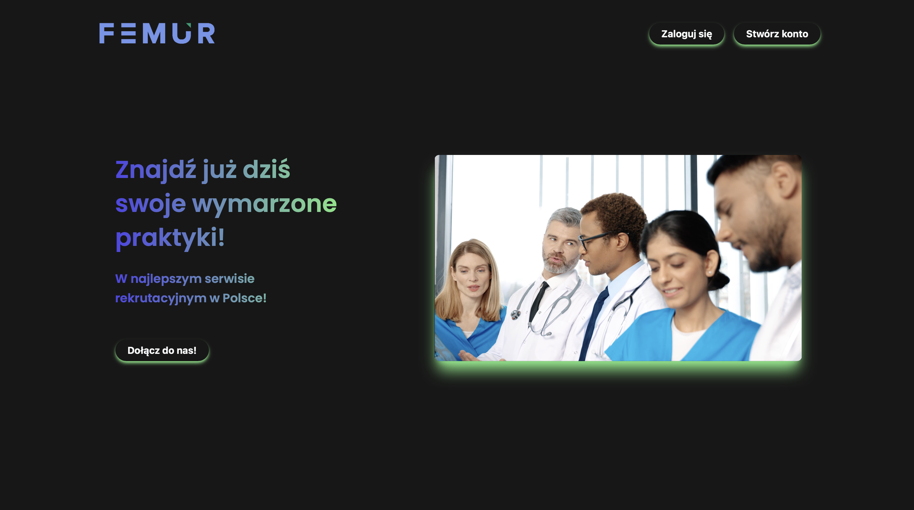

# 🩺 FemurPractices

FemurPractices is a web application designed for medical students looking for places to complete their practical training and internships. This project is being developed as an engineering thesis at the end of a Computer Science university course.

## 📸 Application Screenshot



---

## 🚀 Quick Start with Docker

### 📋 Prerequisites

- [Docker](https://www.docker.com/get-started)
- [Docker Compose](https://docs.docker.com/compose/install/)

### ⚡ Running the Application

```bash
# Clone the repository
git clone https://github.com/Timoth26/FemurPractices.git
cd FemurPractices

# Start the application
docker-compose up --build
```

### 🌐 Access the Application

| Service | URL | Description |
|---------|-----|-------------|
| 🎨 **Frontend** | http://localhost:3000 | React Interface |
| 🔧 **Backend API** | http://localhost:8000 | Django REST API |
| 👨‍💼 **Admin Panel** | http://localhost:8000/admin/ | Django Admin |
| 🗄️ **Database** | localhost:5432 | PostgreSQL |

---

## 🛠️ Useful Commands

```bash
# Run in background
docker-compose up -d

# Stop the application
docker-compose down

# Rebuild containers
docker-compose up --build

# View logs
docker-compose logs -f

# Backend logs only
docker-compose logs -f backend

# Frontend logs only  
docker-compose logs -f frontend
```

## 👤 Creating Admin Account

```bash
# Create Django superuser
docker-compose exec backend python manage.py createsuperuser
```

## 🗄️ Database Management

```bash
# Run migrations
docker-compose exec backend python manage.py migrate

# Create new migrations
docker-compose exec backend python manage.py makemigrations

# Access Django shell
docker-compose exec backend python manage.py shell
```

---

## 🏗️ Architecture

```
┌─────────────────┐    ┌─────────────────┐    ┌─────────────────┐
│   Frontend      │    │    Backend      │    │   Database      │
│   React         │◄──►│   Django REST   │◄──►│   PostgreSQL    │
│   Port: 3000    │    │   Port: 8000    │    │   Port: 5432    │
└─────────────────┘    └─────────────────┘    └─────────────────┘
```

### 🔧 Technology Stack

**Frontend:**
- ⚛️ React 18
- 🎨 Tailwind CSS + Bootstrap
- 📡 Axios (HTTP client)
- 🔐 JWT Authentication
- 🧭 React Router

**Backend:**
- 🐍 Django 4.2
- 🔌 Django REST Framework
- 🔑 SimpleJWT (authentication)
- 🌐 CORS Headers
- 📁 Media file support

**Database:**
- 🐘 PostgreSQL 15

**DevOps:**
- 🐳 Docker & Docker Compose
- 📦 Multi-stage builds

---

## 📁 Project Structure

```
FemurPractices/
├── 📁 backend/                 # Django REST API
│   ├── 📁 app/                 # Main app (internship offers)
│   ├── 📁 authentication/      # User management system
│   ├── 📁 backend/            # Django configuration
│   ├── 📁 media/              # Uploaded files (CVs)
│   ├── 🐳 Dockerfile          # Backend container
│   └── 📄 requirements.txt    # Python dependencies
├── 📁 frontend/               # React SPA
│   ├── 📁 public/             # Public assets
│   ├── 📁 src/                # React source code
│   ├── 🐳 Dockerfile          # Frontend container
│   └── 📄 package.json        # Node.js dependencies
├── 🐳 docker-compose.yml      # Container orchestration
└── 📖 README.md              # This file
```

---

## 🎯 Features

### 👩‍🎓 For Students:
- 📝 Registration and authentication
- 🔍 Search internships with filters
- 📋 Apply to opportunities
- 📄 Upload and manage CV
- 📊 Track application status

### 🏥 For Healthcare Facilities:
- 🏢 Employer registration
- ➕ Create internship offers
- ✏️ Edit and manage listings
- 👥 Review candidates
- 📁 Download applicant CVs

### 🔧 System Features:
- 🔐 Secure JWT authentication
- 📱 Responsive design
- 🌐 RESTful API
- 📄 Admin dashboard
- 🗄️ File management

---